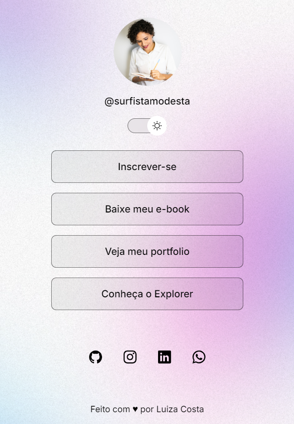

## Projeto Links Encurtados

**Descrição:**

Este é um projeto realizado como exercício de código para desenvolvimento web, promovido pela RocketSeat. O entregável utiliza HTML, CSS e JavaScript para criar um cartão de visitas digital, para reunir links importantes e dados de contato, e pode ser replicado para empresas e outras pessoas.

**Tecnologias Utilizadas:**

* **HTML:** Estrutura básica da página.
* **CSS:** Estilização visual da página.
* **JavaScript:** Adiciona interatividade, como o modo claro/escuro (se implementado).
* **Figma:** Uso da plataforma para captação de informações CSS.

**Como Usar:**

1. **Clone o repositório:** `git clone https://seu-repositorio.git`
2. **Abra o arquivo `index.html` em um navegador.**

**Contribuições:**

Contribuições são bem-vindas! Abra um pull request para sugerir melhorias.

**Contato:**

Para entrar em contato com Luiza Costa, utilize os links das redes sociais presentes na vitrine.

**Exemplo de visualização:**

Dark mode

Light mode

**Detalhes adicionais:**

* **Modo claro/escuro:** A funcionalidade de alternar entre modos claro e escuro é opcional e depende da implementação em JavaScript.
* **Personalização:** Você pode personalizar a aparência e o conteúdo editando os arquivos CSS e HTML.
